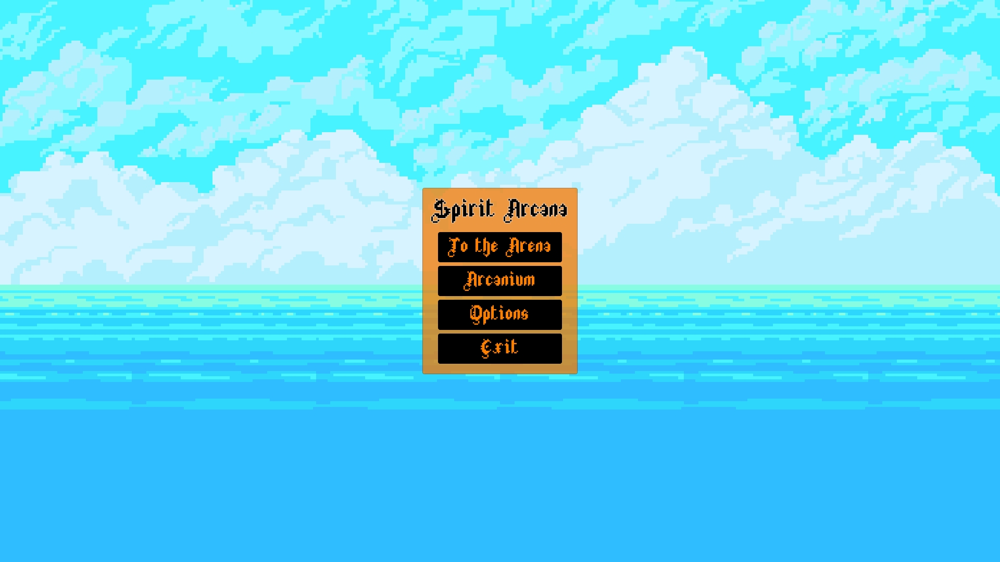
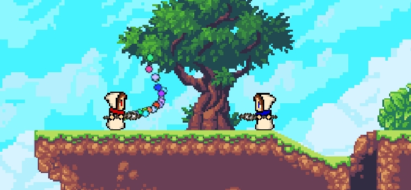

Magic-battles
=============
Эта игра про битву магов, с системой создания аркан (обьектами позволяющими сотворять или усиливать заклинания). Игроки могут участвовать в дуэлях за награды, и пополнять свои хранилища новыми арканами.

## Механика
Игровой процесс происходин на заранее проработанной 2D арене. Игрок управляет боевым магом, его цель победить мага противника (которым управляет другой игрок). В битве игрок может переключаться между не более чем 5-и арканами , арканы игрок выбирает перед боем. Любую аркану игрок может собрать при достатке ресурсов или получить по результатам боя.

## Используемые модели и технологии
### Используемые технологии:
- Unity 3D:
  - Network Manager
- Среда разработки MonoDevelop-Unity:
  - Используется язык программирования C#
### Модель создания аркан:
- Игрок собирает кристалл, набирая определёнyое количество эссенции от чего зависит эффект заклинания.
- Игрок отливает оправу из металла по литейной форме.
- Игрок накладывает чары на кристалл в оправе. Чары определяют форму заклинания, существуют три класса форм:
  - Атакующая
  - Пассивная
  - Поддерживающая

## Руководство для программиста
В панели Hierarchy есть следующие объекты:
- Level — используется для размещения статический, или всегда присутствующих объектов.
  - Background — пока не используется.
  - Middleground — используется для интерактивный или около-интерактивных объектов.
  - Foreground — пока не используется.
- Render — в этом объекте хранятся объекты связанные с камерой и сама камера.
  - Main Camera — основная камера.
  - Canvas — холст для отрисовки заднего фона.
  - Canvas(UI) — холст на котором находится весь интерфейс.
- Network Manager — главная часть работы по локальной сети.

В проекте используются следующие скрипты:
- Unit.cs — класс являющийся родителем любого управляемого объекта.
- Bullet.cs — описывает определённую пулу (в будущем все виды атак будут описываться скриптом Spel.cs).
- Mage_control.cs — описывает поведение мага при тех или иных действиях управляющего.
- ArcanaManager.cs — скрипт отвечающий за информацию о боевых арканах.
  
## Реализация:
Реолизовано (пока что не всё) на движке Unity 3D, используя скрипты написанные на C#.
На данный момент вы можете передвигаться по карте и стрелять из посоха, посох будет разворачиваться через верх при развороте мага. Также игрок может умереть от черезмерного количества попавших в него снарядов (в том числе и своих).

## Ссылки
### Список литературы:
- Англоязычная документация Unity3d: https://docs.unity3d.com/ScriptReference/
- Создание простого 2D платформера в Unity3D: https://www.youtube.com/watch?time_continue=1&v=CAPVBTKk3Ww
### Используемые материалы:
- Набор текстур для разработки игр “Sunny Land”: https://ansimuz.itch.io/sunny-land-pixel-game-art
- Набор шрифтов “More Fonts”: https://somepx.itch.io/more-fonts
- Набор шрифтов “From Patreon V3”: https://somepx.itch.io/from-patreon-vol-3
- Набор шрифтов “Random Fonts”: https://tokkatrain.itch.io/random-fonts
